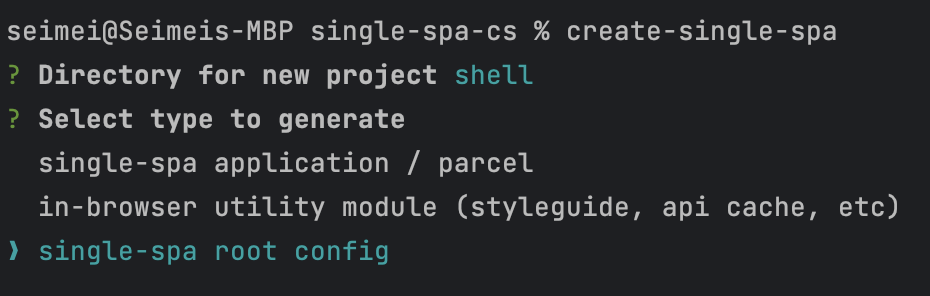
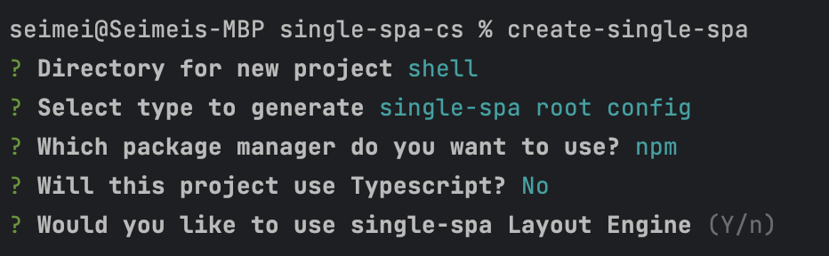
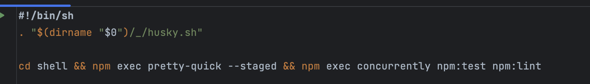

# Example project for Connected Showroom

This project loads a series of Micro Frontends using different frameworks. It is to demonstrate how to set up the Connected Showroom application and unify the U.S. code line and the BR code line.

Below are the documented steps as they are done

## Create a ss root project

### Run the command `npx create-single-spa` 
This will start the process to create the shell application

### Select `single-spa root config` 

Usually the is named shell but you can name it what you wish

### Select the package manager you wish to use

In this case we are using npm

### Select if you wish to use Typescript

In this case we are going with good old JavaScript

### Choose if you want to use the layout engine

The layout engine facilitates routing, it also adds some server side rendering capabilities

### Select and organization name

This step requires a bit more thought because it can become tricky to change it later. It is not impossible but it is best to simply start with the organization name you want to use and save the effort 

### Final Step for creating the Shell

Once you hit enter the create-single-spa application will run, it will generate the project and initiate a `npm i` which will install the dependencies

### Setting up husky

Husky is a great tool for enforcing style, linting and other git hooks. Unfortunately the .husky directory usually needs to sit in the same place as the .git directory which is where the git repo settings, history and configurations are. Currently this require a workaround for husky to function correctly.

#### Change the `prepare` script

Inside your project directory, in this case `shell` you need to update the package.json file. The script for husky by default will be `"prepare": "husky install"` It needs to be changed to: `"prepare": "cd .. && husky install shell/.husky"` If you project is nested deeper you need to make sure the `cd` command takes you to the same level as the .git directory.

#### Update the pre-commit script

Inside the `shell/.husky` directory there will be a file called pre-commit. You will need to open this file and edit the script there. In our example the .git directory is one step up, as this project is a mono-repo (all the different projects are in one repository). If your project has the project nested deeper then you will need to provide the appropriate path.

Before:

After:

#### One last thing

If you are on a POSIX OS (Unix, Linux, MacOS) you will need to also set the file to execute. In the terminal change to the .husky directory and set the file to execute `chmod +x pre-commit`

