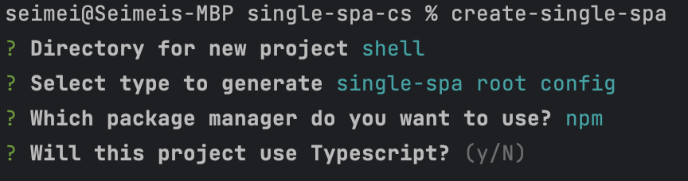

# Example project for Connected Showroom

This project loads a series of Micro Frontends using different frameworks. It is to demonstrate how to set up the Connected Showroom application and unify the U.S. code line and the BR code line.

Below are the documented steps as they are done

## Create a ss root project

### Run the command `npx create-single-spa` 
This will start the process to create the shell application

### Select `single-spa root config` 

Usually the is named shell but you can name it what you wish

### Select the package manager you wish to use

In this case we are using npm

### Select if you wish to use Typescript

In this case we are going with good old JavaScript

### Choose if you want to use the layout engine

The layout engine facilitates routing, it also adds some server side rendering capabilities

### Select and organization name

This step requires a bit more thought because it can become tricky to change it later. It is not impossible but it is best to simply start with the organization name you want to use and save the effort 

### Final Step for creating the Shell

Once you hit enter the create-single-spa application will run, it will generate the project and initiate a `npm i` which will install the dependencies

