# Example project for Connected Showroom using single-spa

This project loads a series of Micro Frontends using different frameworks. It is to demonstrate how to set up the Connected Showroom application and unify the U.S. code line and the BR code line.

Below are the documented steps as they are done

## Create a ss root project

### Run the command `npx create-single-spa` 
This will start the process to create the shell application

### Select `single-spa root config` 

Usually the is named shell but you can name it what you wish

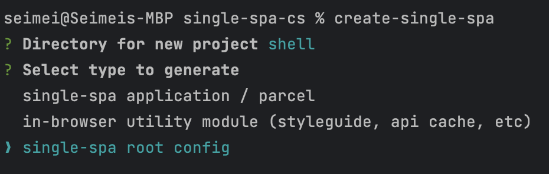

### Select the package manager you wish to use

In this case we are using npm

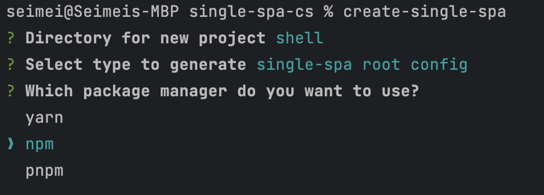

### Select if you wish to use Typescript

In this case we are going with good old JavaScript


### Choose if you want to use the layout engine

The layout engine facilitates routing, it also adds some server side rendering capabilities

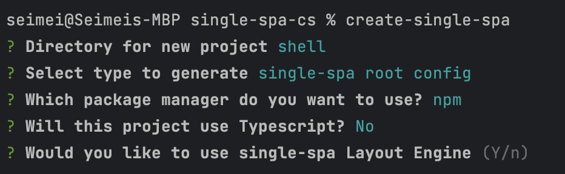

### Select and organization name

This step requires a bit more thought because it can become tricky to change it later. It is not impossible but it is best to simply start with the organization name you want to use and save the effort 

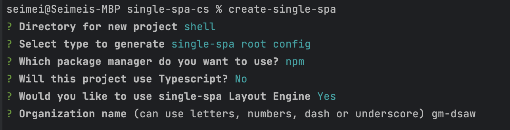

### Final Step for creating the Shell

Once you hit enter the create-single-spa application will run, it will generate the project and initiate a `npm i` which will install the dependencies

### Setting up husky

Husky is a great tool for enforcing style, linting and other git hooks. Unfortunately the .husky directory usually needs to sit in the same place as the .git directory which is where the git repo settings, history and configurations are. Currently this require a workaround for husky to function correctly.

#### Change the `prepare` script

Inside your project directory, in this case `shell` you need to update the package.json file. The script for husky by default will be `"prepare": "husky install"` It needs to be changed to: `"prepare": "cd .. && husky install shell/.husky"` If you project is nested deeper you need to make sure the `cd` command takes you to the same level as the .git directory.

#### Update the pre-commit script

Inside the `shell/.husky` directory there will be a file called pre-commit. You will need to open this file and edit the script there. In our example the .git directory is one step up, as this project is a mono-repo (all the different projects are in one repository). If your project has the project nested deeper then you will need to provide the appropriate path.

Before:

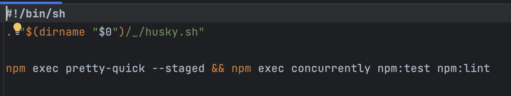

After:

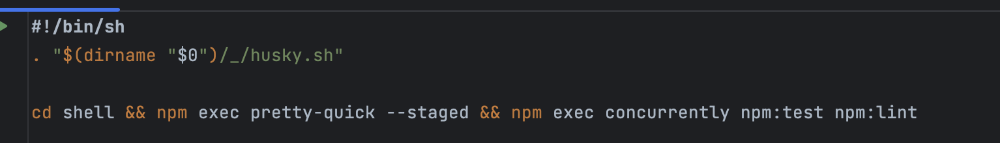

#### One last thing

If you are on a POSIX OS (Unix, Linux, MacOS) you will need to also set the file to execute. In the terminal change to the .husky directory and set the file to execute `chmod +x pre-commit`

You may find, depending on your Windows setup you will also need to set the file to allow it to execute. This is an edge case however if you run into an issue where the git hooks do not run when you commit got to the pre-commit file, right click and go to properties. There you can set to allow the file to execute

## Create a React project

React is a commonly used framework and has taken the lead in the framework wars. The advantages of a low threshold to start and fast time-to-market has made it the most popular framework to date.

### Run the command `npx create-single-spa`

### Select the single-spa application / parcel option

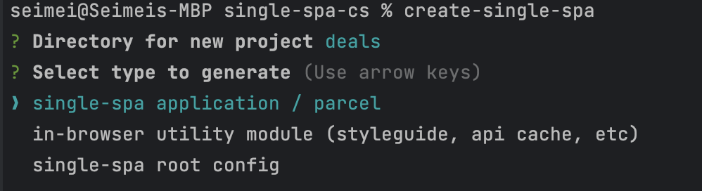

### Select the React option

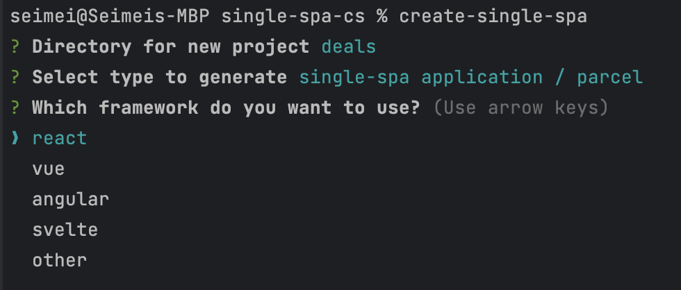

### Select the package manager

In this case I selected npm

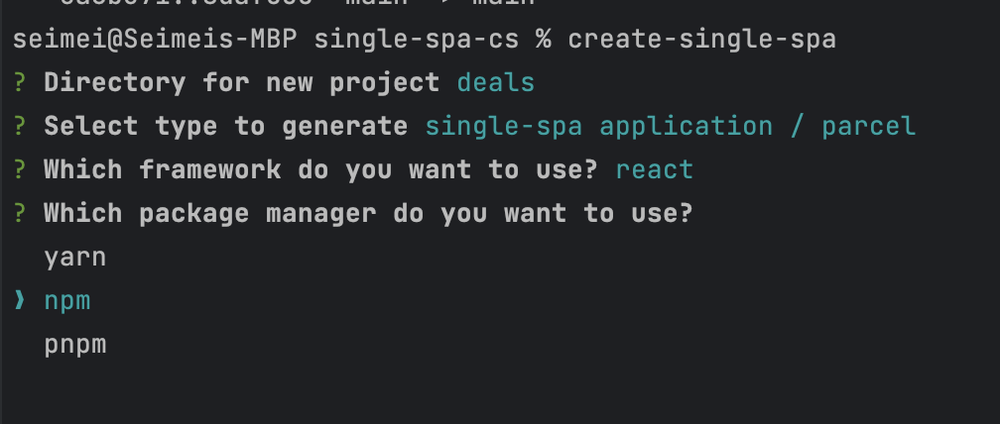

### Select if you want to use Typescript

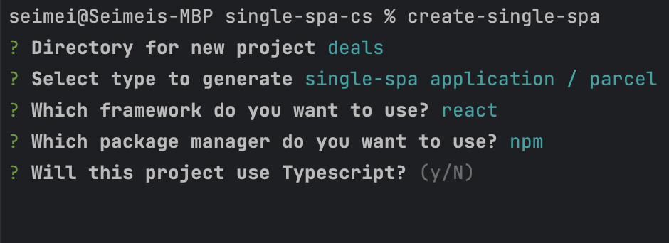

### Enter an organization name

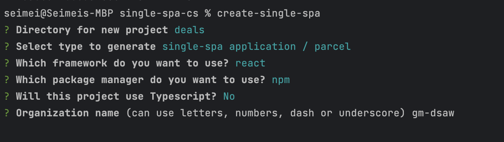

### Finally enter a project name

After pressing `ENTER` the project build process will start and npm will install the dependencies.

### Reconfigure husky like you did for the root config if you have a custom placement for .git directory 

### Add the React project to the shell

Once the React MFE is set up and running it must be added to the shell. It can also be run stand alone but that is another section

#### Add the MFE to the shell/src/index.ejs import maps

This will make the MFE available to load

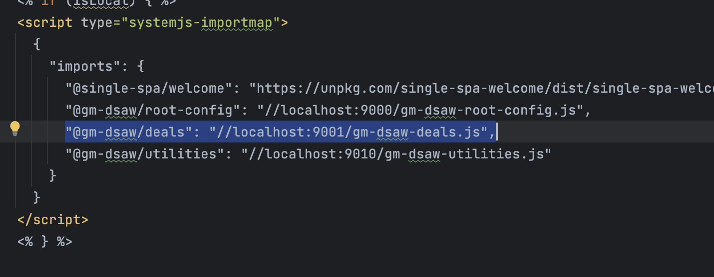

#### Loading the React MFE

To make the MFE load, we will use the **microfrontend-layout.html** since we chose to use the layout engine when creating the shell. The layout.html can be named anything but we used the default name

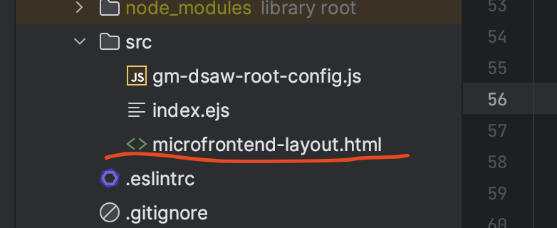

Here we create a route for the React application, in this case called Deals

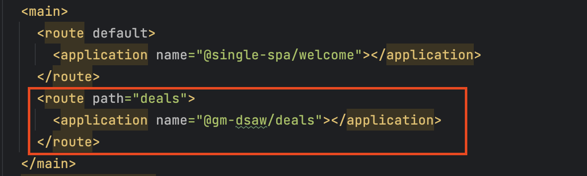

#### Run the shell application and the React application, in this case deals, enter /deals into the browser and the React app should show

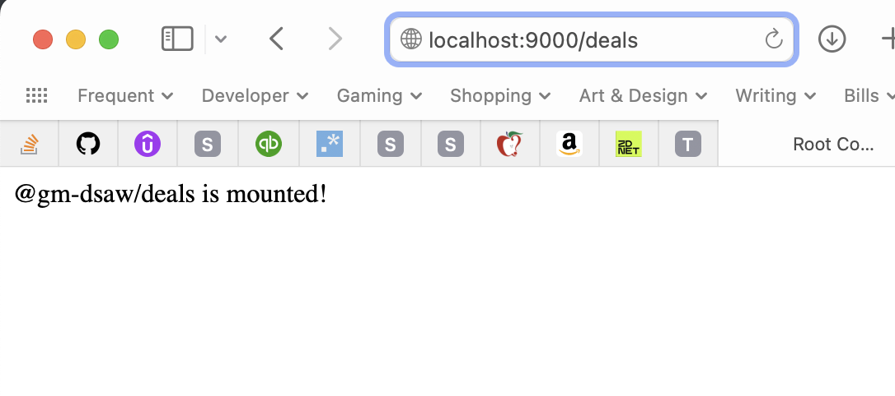

## How to setup a Utilities bundle

A utilities bundle or project is a way to share libraries, styles, or components across applications so they are only ever loaded once. 

You can consider a utilities bundle as a gateway to all the other libraries you may use or to share common functions, APIs, etc across all MFEs. Do keep in mind, however, you should try to keep each MFE encapsulated as much as possible. Too much shared code across MFEs or MFEs that know too much about others can lead to dependencies that will make the pattern less effective.

Keep in mind, the strength of the MFE architecture is each MFE is a separate, independently deployable application. 

### Run the command `npx create-single-spa`

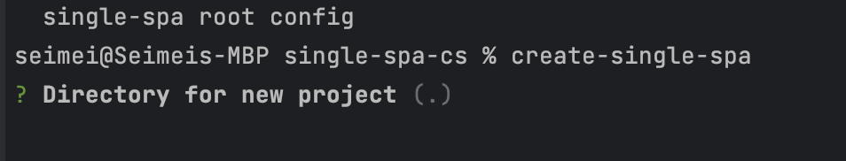

### Next select the `in-browser utility module (style guide, api, cache, etc)` option 

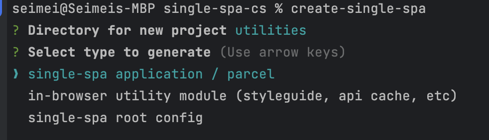

### You can choose a framework for this option or select none. I went with none for this guide

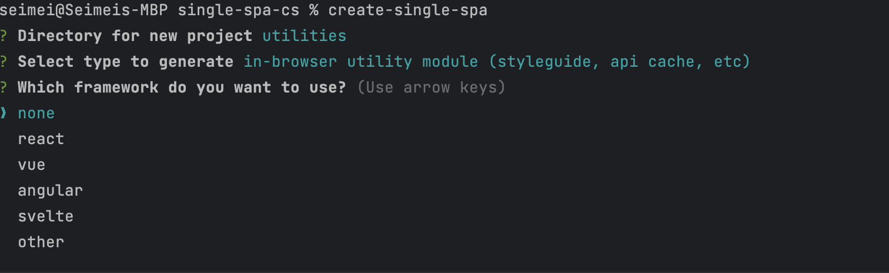

### Select a package manager, went with npm again to be consistent. If you are using a mono repo this is more important than if you are using separate repos which is the standard setup

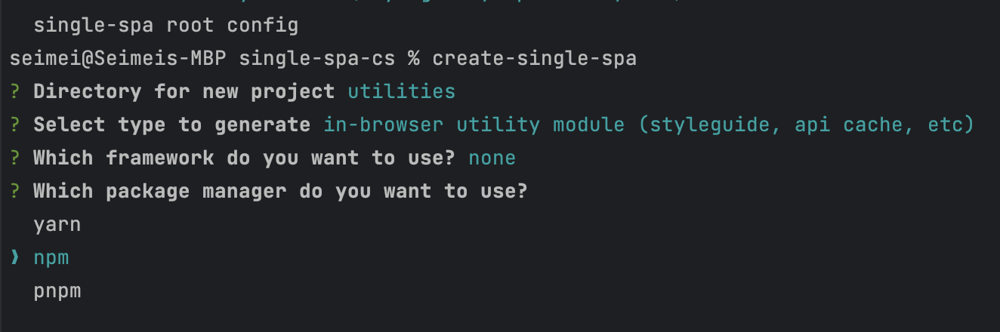

### Select if you want to use Typescript

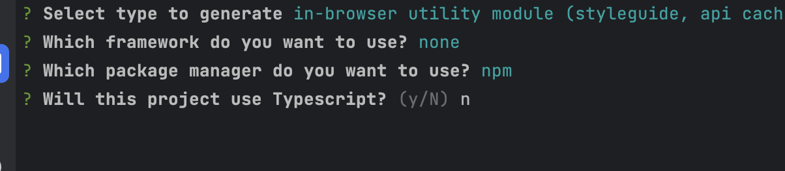

### Enter organization name as in previous steps

### Enter the project name,  I chose utilities

### Set up husky as in previous examples

## Add the Utilites project to the application

### Add the utilties to the index.ejs file import map

Add the utilities bundle as you would another MFE into the inport maps on the shell ejs file

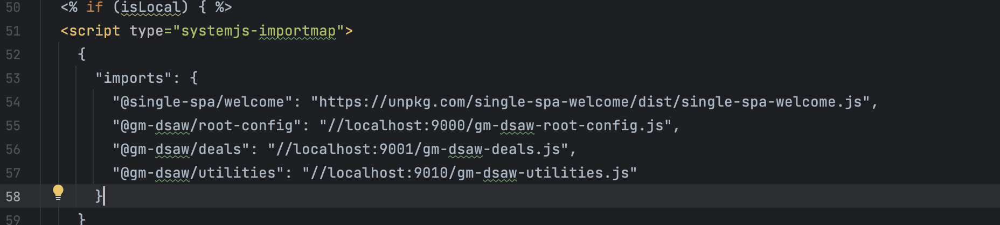

### Set the bundle as an external in the web pack.config.js

This will need to be done for every MFE that is to use the utilities so Webpack will know any references are external so it will look for them and load them using Module Federation. 

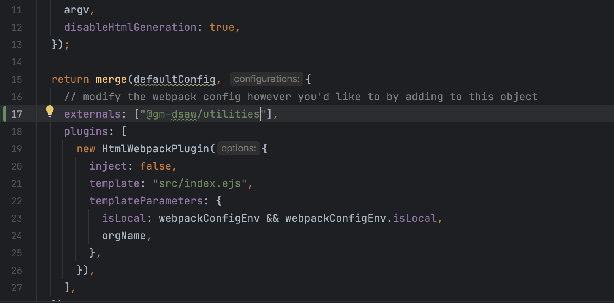

### Export anything you wish to be external in the utilites from main js file

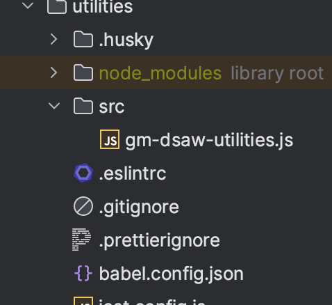

A simple function with a console log is exported in this example. It can be anything including various node libraries, JS modules, etc

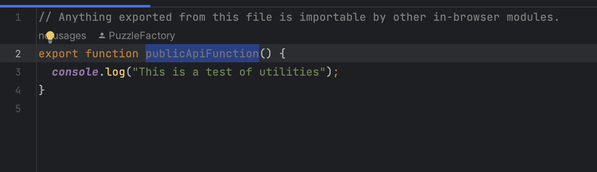

### Import into your project what you want to use from the utilties as you would import normally. 

In many IDEs, code completion may not pick up the external library and give you code completion however GitHub CoPilot seems to do a fair job at it.

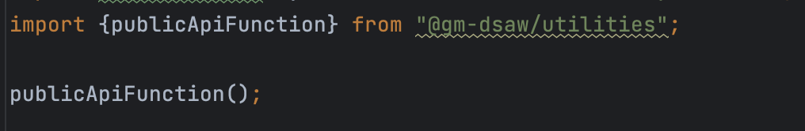

The console log showing in the browser

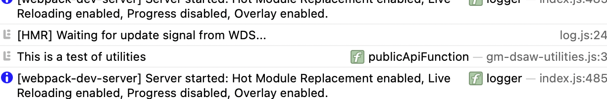

### Notes

* Any utility set up in this manner is in fact a MFE itself, however its purpose is to provide resources
* Only exported members, exported from the root js file found in the src directory will be discoverable. 
* When adding the utility to other MFEs, remember to not only add the import internally but also to do the webpack.config.js step, to add it to externals

## Adding an Angular Project Using the create-single-spa app

### Run the `npx create-single-spa` command and select the `single-spa applicaiton / parcel` choice after naming the directory

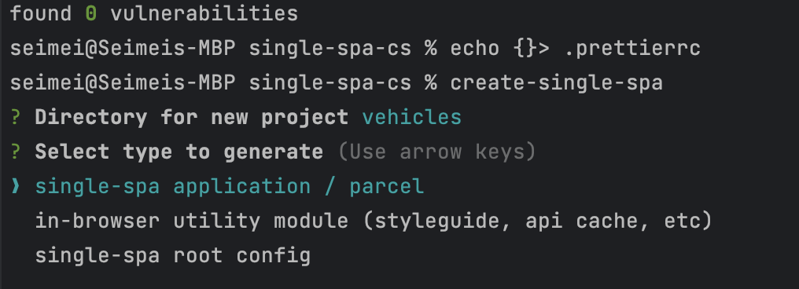 

### Select Angular as the framework

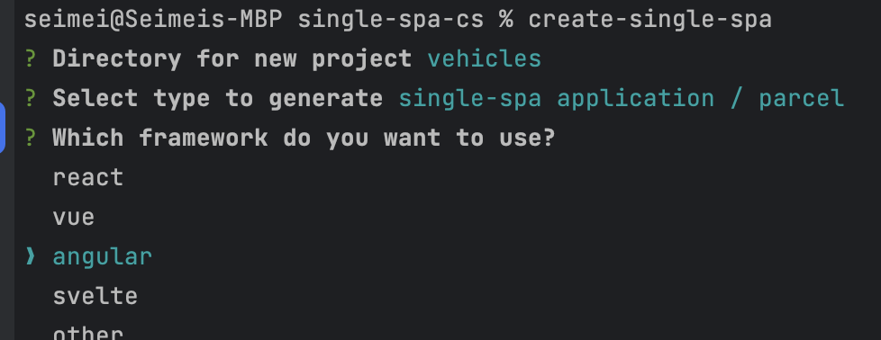

### Follow the next step to enter a project name

### If you want routing in the Angular application choose that option

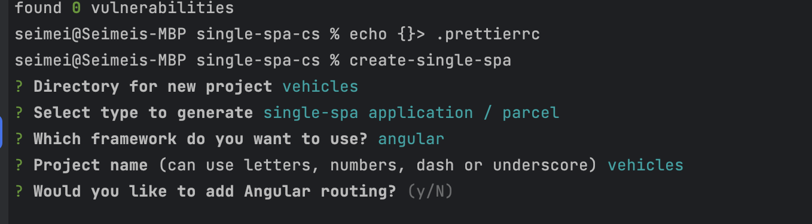

### Pick the style setting for Angular

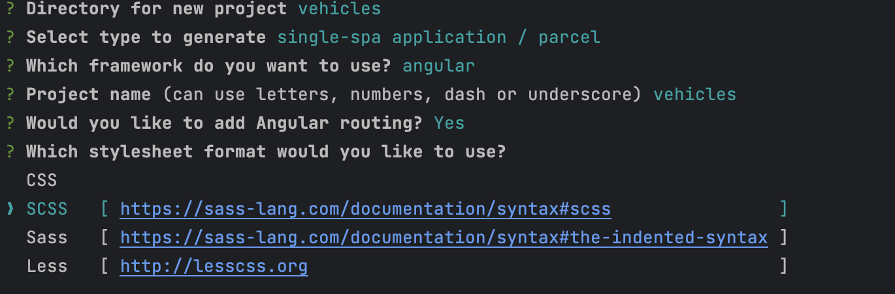

After this, when you hit enter, the @angular/cli will take over and buid an Angular application. When this is completed proceed to the next step

### Either run the schematic for single-spa or do a manual setup. 

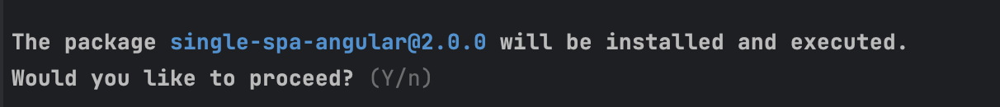

For me the schematic has never completed successfully, but it does a lot of setup so I still run it. Later updates might fix this, hopefully.  If it ever works, I will add those steps here, but for now the next step is if the schematic fails

### If the schematic fails instead try the next section

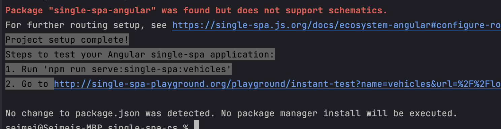

## Create Angular Project manually

### Create an Angular application using the @angular/cli `ng new vehicles --routing true --style scss`

This wil create an Angular application with routing and using SASS. You can set these to anything you normally would use

### Install [@angular-builders/custom-webpack](https://www.npmjs.com/package/@angular-builders/custom-webpack) using the command `npm i -D @angular-builders/custom-webpack`

### Install single-spa `npm i single-spa single-spa-angular`

### Add a custom Webpack config file:

#### Create a JavaScript file and name it `extra-webpack.config.js`

```javascript
const singleSpaAngularWebpack = require('single-spa-angular/lib/webpack').default;

module.exports = (config, options) => {
  const singleSpaWebpackConfig = singleSpaAngularWebpack(config, options);

  // Feel free to modify this webpack config however you'd like to
  return singleSpaWebpackConfig;
};
```

### Update the angular.json to use the builder

The below areas the default Angular builder needs to be replaced with the `@angular-builders/custom-webpack` builder. 

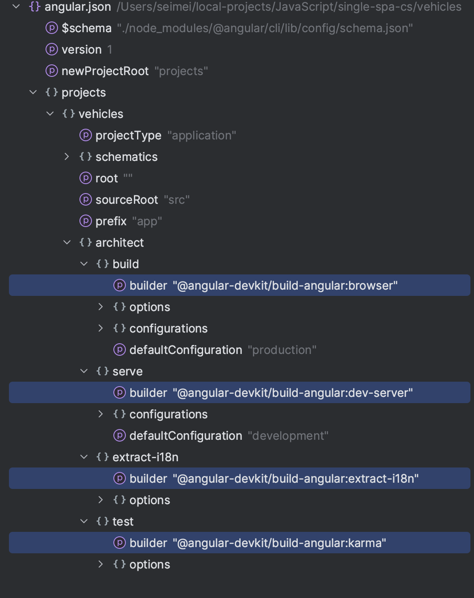

#### architect.build.builder

#### architect.serve.builder

#### architect.extract-i18n.builder

#### architect.test.builder

### The end product should be all builders are replaced

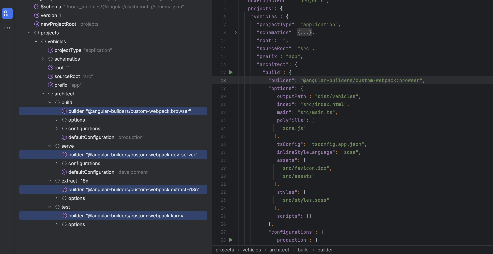

You can do this with a find/replace: **Find**: `@angular-devkit/build-angular` **Replace** `@angular-builders/custom-webpack`

### Create a new Typescript file in `src` and name it main.single-spa.ts

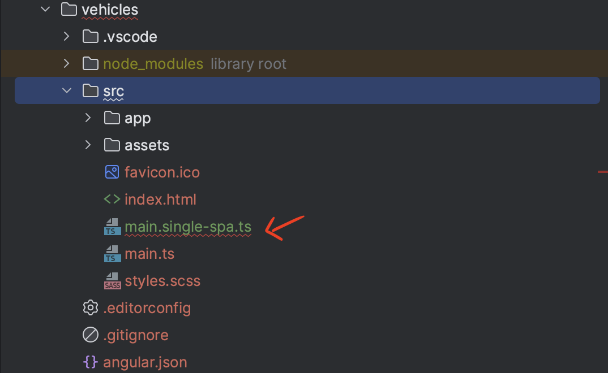

### Place this code in the main.single-spa.ts file

```typescript
import { enableProdMode, NgZone } from '@angular/core';

import { platformBrowserDynamic } from '@angular/platform-browser-dynamic';
import { Router, NavigationStart } from '@angular/router';

import { singleSpaAngular, getSingleSpaExtraProviders } from 'single-spa-angular';


import { AppModule } from './app/app.module';
import { environment } from './environments/environment';
import { singleSpaPropsSubject } from './single-spa/single-spa-props';

if (environment.production) {
  enableProdMode();
}

const lifecycles = singleSpaAngular({
  bootstrapFunction: singleSpaProps => {
    singleSpaPropsSubject.next(singleSpaProps);
    return platformBrowserDynamic(getSingleSpaExtraProviders()).bootstrapModule(AppModule);
  },
  template: '<app-root />',
  Router,
  NavigationStart,
  NgZone,
});

export const bootstrap = lifecycles.bootstrap;
export const mount = lifecycles.mount;
export const unmount = lifecycles.unmount;
```

This is the main code to add the Angular application to single-spa. I have not done a standalone components project yet so this is using Angular modules. 

### Set Angular to use the main.single-spa.ts in place of main.ts

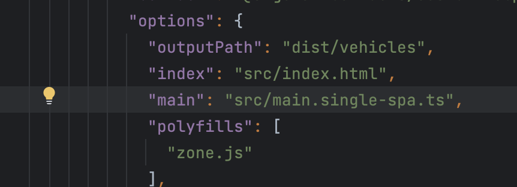

### Add the main.single-spa.ts to your `tsconfig.app.json`

```json
/* To learn more about this file see: https://angular.io/config/tsconfig. */
{
  "extends": "./tsconfig.json",
  "compilerOptions": {
    "outDir": "./out-tsc/app",
    "types": []
  },
  "files": [
    "src/main.single-spa.ts"
  ],
  "include": [
    "src/**/*.d.ts"
  ]
}
```

### Add the single-spa setup files

#### Create a directory in the root of src and name it single-spa

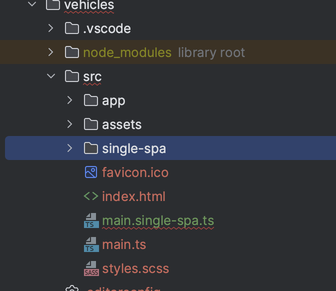

#### Add a Typescript file to `src/single-spa/single-spa-props.ts`

```typescript
import { ReplaySubject } from 'rxjs';
import { AppProps } from 'single-spa';

export const singleSpaPropsSubject = new ReplaySubject<SingleSpaProps>(1);

// Add any custom single-spa props you have to this type def
// https://single-spa.js.org/docs/building-applications.html#custom-props
export type SingleSpaProps = AppProps & {};
```

#### Next create a file `src/single-spa/asset-url.ts

```typescript
// In single-spa, the assets need to be loaded from a dynamic location,
// instead of hard coded to `/assets`. We use webpack public path for this.
// See https://webpack.js.org/guides/public-path/#root

export function assetUrl(url: string): string {
  // @ts-ignore
  const publicPath = __webpack_public_path__;
  const publicPathSuffix = publicPath.endsWith('/') ? '' : '/';
  const urlPrefix = url.startsWith('/') ? '' : '/';

  return `${publicPath}${publicPathSuffix}assets${urlPrefix}${url}`;
}
```

### Add environment files if you need them

Environment files are not required and can be left off but if you need them for your project then you will need to add them as of Angular 15 they are not automatically generated. You will also need to add them to the angular.json

#### For environment/environment.prod.ts 

```typescript
export const environment = {
  production: true
};
```

#### For environment/environment.ts

```typescript
export const environment = {
  production: false
};
```
