# Example project for Connected Showroom using single-spa

This project loads a series of Micro Frontends using different frameworks. It is to demonstrate how to set up the Connected Showroom application and unify the U.S. code line and the BR code line.

Below are the documented steps as they are done

## Create a ss root project

### Run the command `npx create-single-spa` 
This will start the process to create the shell application

### Select `single-spa root config` 

Usually the is named shell but you can name it what you wish

### Select the package manager you wish to use

In this case we are using npm

### Select if you wish to use Typescript

In this case we are going with good old JavaScript

### Choose if you want to use the layout engine

The layout engine facilitates routing, it also adds some server side rendering capabilities

### Select and organization name

This step requires a bit more thought because it can become tricky to change it later. It is not impossible but it is best to simply start with the organization name you want to use and save the effort 

### Final Step for creating the Shell

Once you hit enter the create-single-spa application will run, it will generate the project and initiate a `npm i` which will install the dependencies

### Setting up husky

Husky is a great tool for enforcing style, linting and other git hooks. Unfortunately the .husky directory usually needs to sit in the same place as the .git directory which is where the git repo settings, history and configurations are. Currently this require a workaround for husky to function correctly.

#### Change the `prepare` script

Inside your project directory, in this case `shell` you need to update the package.json file. The script for husky by default will be `"prepare": "husky install"` It needs to be changed to: `"prepare": "cd .. && husky install shell/.husky"` If you project is nested deeper you need to make sure the `cd` command takes you to the same level as the .git directory.

#### Update the pre-commit script

Inside the `shell/.husky` directory there will be a file called pre-commit. You will need to open this file and edit the script there. In our example the .git directory is one step up, as this project is a mono-repo (all the different projects are in one repository). If your project has the project nested deeper then you will need to provide the appropriate path.

Before:

After:

#### One last thing

If you are on a POSIX OS (Unix, Linux, MacOS) you will need to also set the file to execute. In the terminal change to the .husky directory and set the file to execute `chmod +x pre-commit`

You may find, depending on your Windows setup you will also need to set the file to allow it to execute. This is an edge case however if you run into an issue where the git hooks do not run when you commit got to the pre-commit file, right click and go to properties. There you can set to allow the file to execute

## Create a React project

React is a commonly used framework and has taken the lead in the framework wars. The advantages of a low threshold to start and fast time-to-market has made it the most popular framework to date.

### Run the command `npx create-single-spa`

### Select the single-spa application / parcel option

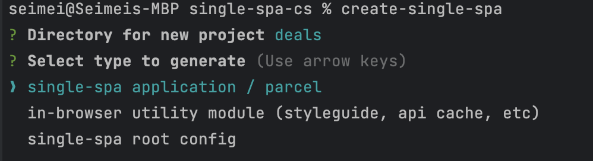

### Select the React option

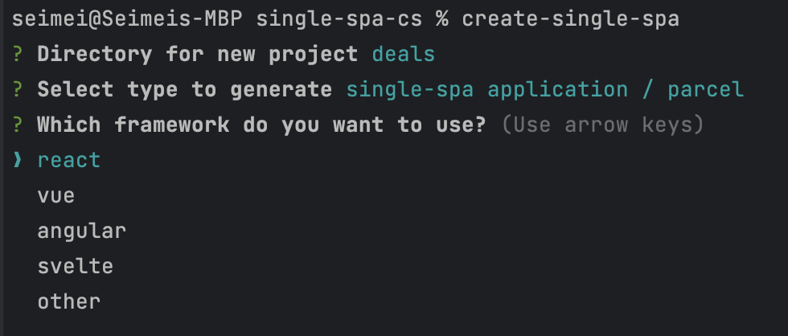

### Select the package manager

In this case I selected npm

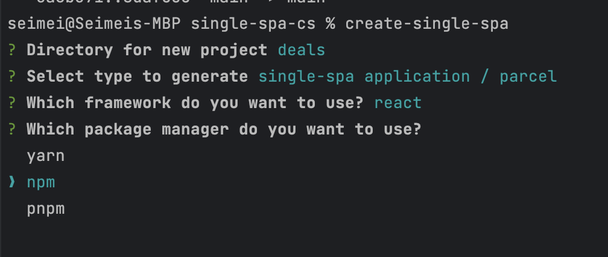

### Select if you want to use Typescript

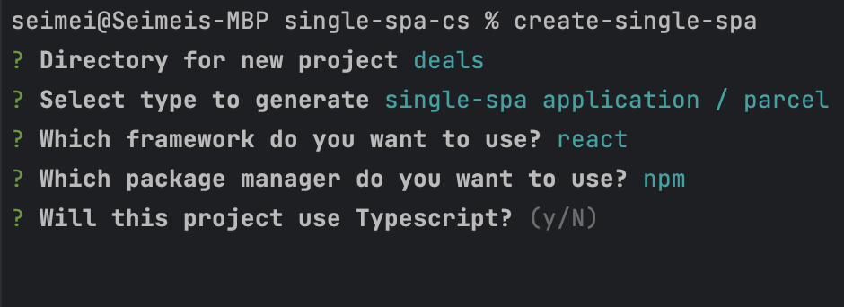

### Enter an organization name

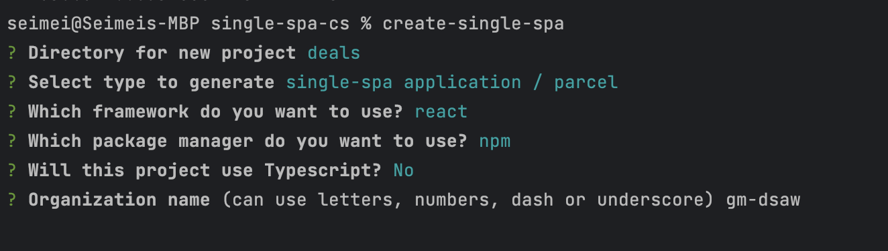

### Finally enter a project name

After pressing `ENTER` the project build process will start and npm will install the dependencies.

### Reconfigure husky like you did for the root config if you have a custom placement for .git directory 

## How to setup a Utilities bundle

A utilities bundle or project is a way to share libraries, styles, or components across applications so they are only ever loaded once. 

You can consider a utilities bundle as a gateway to all the other libraries you may use or to share common functions, APIs, etc across all MFEs. Do keep in mind, however, you should try to keep each MFE encapsulated as much as possible. Too much shared code across MFEs or MFEs that know too much about others can lead to dependencies that will make the pattern less effective.

Keep in mind, the strength of the MFE architecture is each MFE is a separate, independently deployable application. 

### Run the command `npx create-single-spa`

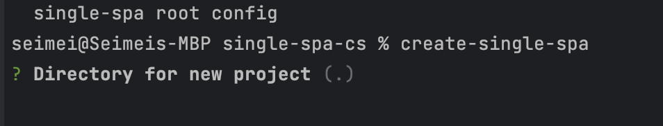

### Next select the `in-browser utility module (style guide, api, cache, etc)` option 

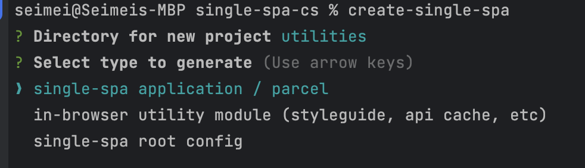

### You can choose a framework for this option or select none. I went with none for this guide

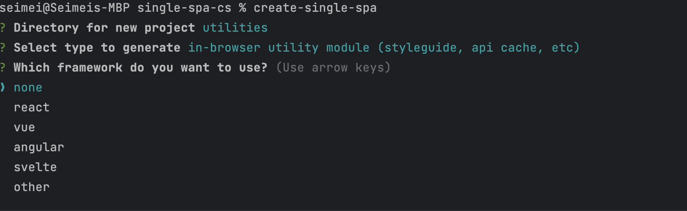

### Select a package manager, went with npm again to be consistent. If you are using a mono repo this is more important than if you are using separate repos which is the standard setup

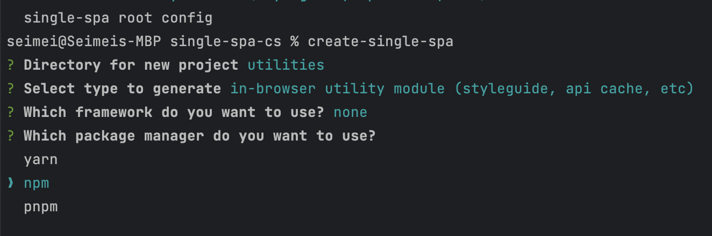

### Select if you want to use Typescript

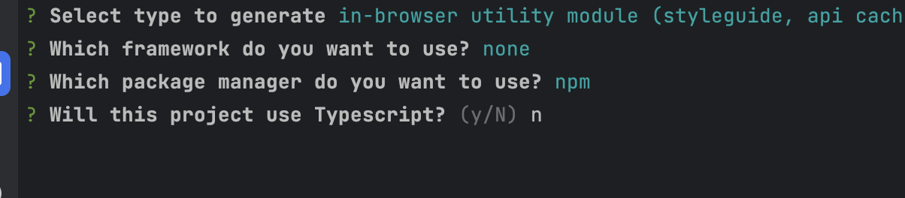

### Enter organization name as in previous steps

### Enter the project name,  I chose utilities

### Set up husky as in previous examples

## Add the Utilites project to the application

### Add the utilties to the index.ejs file import map

Add the utilities bundle as you would another MFE into the inport maps on the shell ejs file

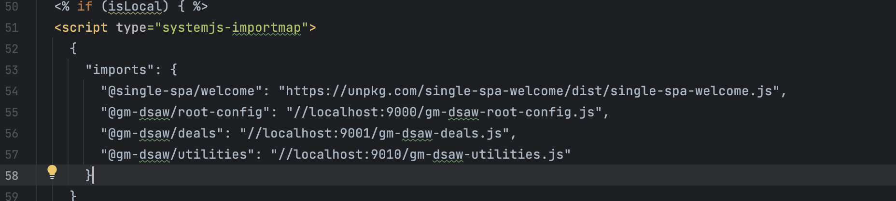

### Set the bundle as an external in the web pack.config.js

This will need to be done for every MFE that is to use the utilities so Webpack will know any references are external so it will look for them and load them using Module Federation. 

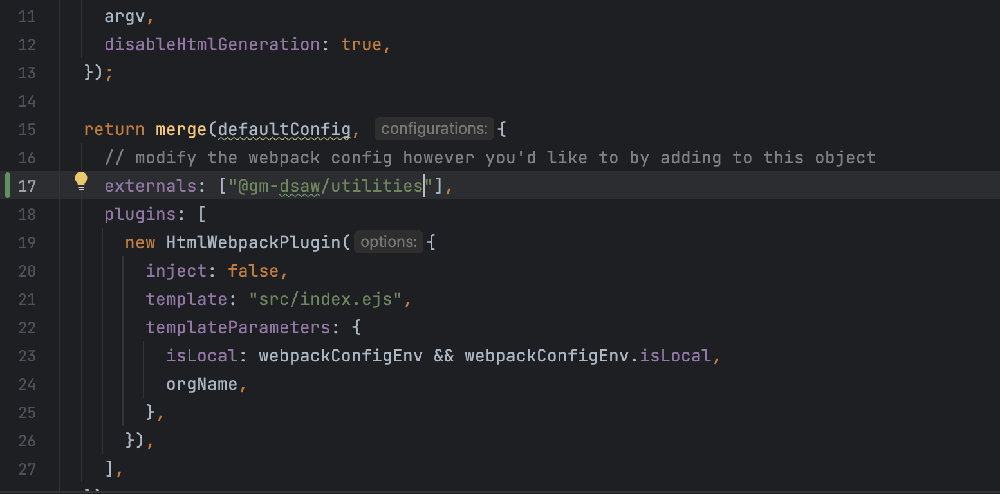

